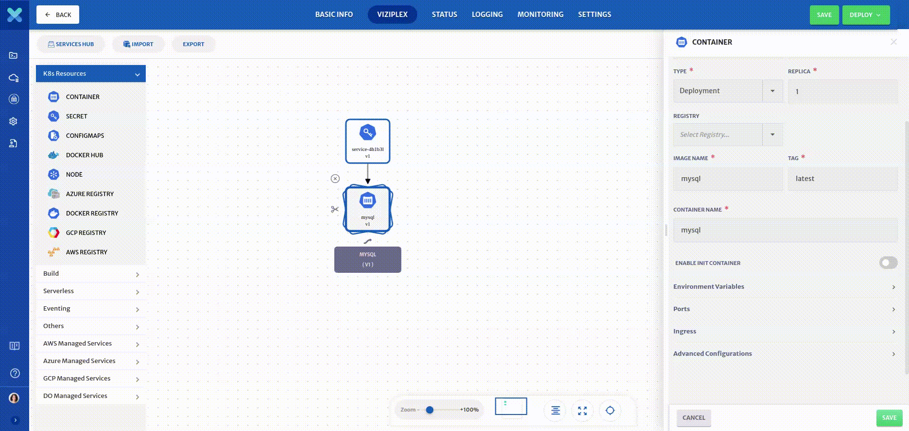
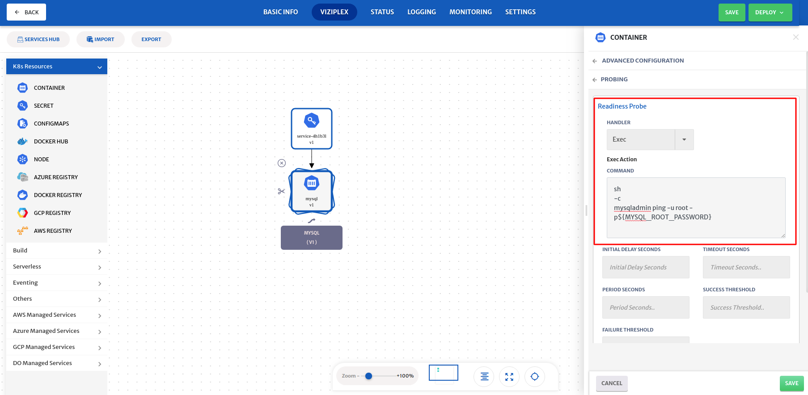
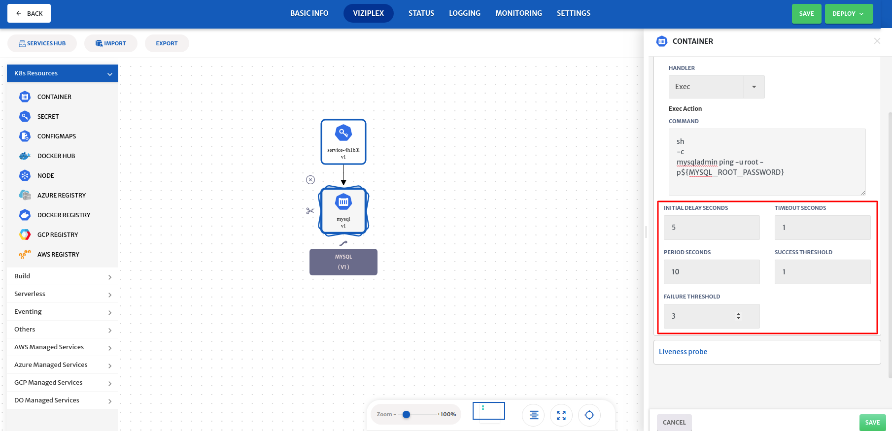
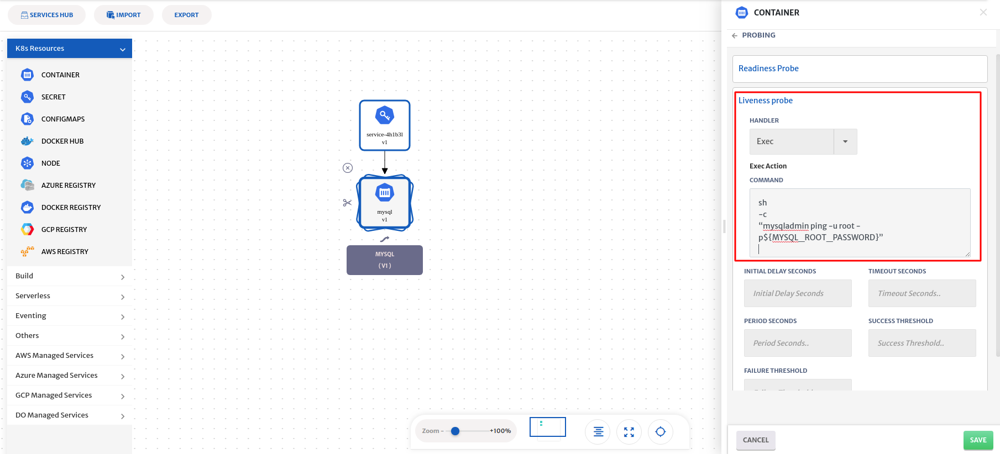
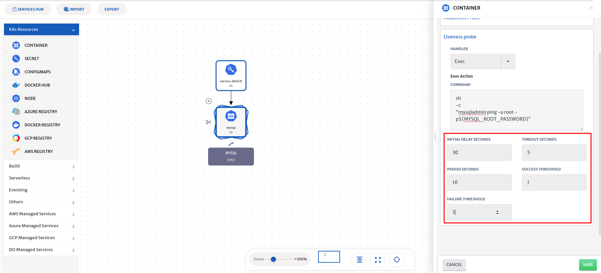

#### Objective

In this lab, you will learn how to deploy a MySQL server and configure Probing using Cloudplex.

#### Prerequisite

If you want to deploy this lab, you need to deploy at least one infrastructure. We have labs on infrastructure as well, you can follow them to deploy infrastructure


#### Add Application Info

Give name to your application and specify the version, you can add tags to your application as well


Click on the **next** button on the top right corner.


#### Add Secret Service

CloudPlex platform provides a secret management service that provides the ability to store sensitive data such as passwords, tokens, and certificates in Cloudplex. Any data entered in this service is stored in a secure vault with at-rest encryption. This eventually becomes a [Kubernetes Secret](https:/kubernetes.io/docs/concepts/configuration/secret) in a deployed application.

To configure the service, Drag-n-drop **Secret service** from pallet to the canvas.


Click on the service to open the configuration panel on the right side.

The platform will populate the default values of service (Service Id, Service Name, Namespace)


Click on Add secret string and type ***MYSQL_ROOT_PASSWORD*** in key and the Password in the value field. For this lab, type (the password as shown) ***5dzo2MsriVJNYTTtud8gOyDc3A*** in the value field.


```yaml
key : MYSQL_ROOT_PASSWORD
value : 5dzo2MsriVJNYTTtud8gOyDc3A
```

Click on save button to save service


#### Configure the MySQL Container

Drag-n-drop the ***Docker Hub*** service from pallet to the canvas.


Drag the arrow from ***Secret*** service to ***Container*** service.


Click on the service to open the configuration panel on the right side.


Type MySQL in the search bar and click on the search button.


Select MySQL service.


CloudPlex automatically pulls all the tags and metadata of the image and populates default values of service (Service Id, Service Name, Namespace, Type)


##### Add new Environment Variables 

Click on the **Environment variables section** to add a new [environment variable](https:/kubernetes.io/docs/tasks/inject-data-application/define-environment-variable-container/#define-an-environment-variable-for-a-container).

Cloudplex provides two types of variables ([Static](https://docs.cloudplex.io/#/pages/user-guide/components/k8s-resources/container/container), [Dynamic](https://docs.cloudplex.io/#/pages/user-guide/components/k8s-resources/container/container)). We are going to use Dynamic variable in this lab to use the ***Secret*** key in our container


Select the secret service from the service drop-down and type MYSQL_ROOT_PASSWORD in the key field.


Expand ***Service Attributes*** and Secrets Data and select ***MYSQL_ROOT_PASSWORD***. Cloudplex automatically generates dynamic  parameters for you.


Click on the save button to save the parameters.


A new environment variable with the key ***MYSQL_ROOT_PASSWORD*** will be added in the list of Environment Variables.


Click on the back button on top of the configurations.


##### Add new Port

[Ports](https:/kubernetes.io/docs/concepts/services-networking/connect-applications-service/#the-kubernetes-model-for-connecting-containers) are required to access your applications. Click on the **Port section** to add a new port


Cloudplex automatically discovers ports from Docker images and populates them in the ports section of the service.


Click on the save button to save the service.


#### Configure Probing

Now that you have created a MySQL container and a CloudPlex secret service, let’s configure probing

Kubernetes liveness and readiness probes can be used to make a service more robust and more resilient, by reducing operational issues and improving the quality of service.

Click on the ***Advance Configurations*** and then Click on the ***Probing*** section to expand and Configure Probing for your service



##### Readiness Probe

Kubernetes uses readiness probes to decide when the container is available for accepting traffic. A pod is considered ready when all of its containers are ready. 

Lets configure readiness probe first, Select ***Exec*** from handler dropdown and pass the following command. 

```yaml
sh
-c
mysqladmin ping -u root -p${MYSQL_ROOT_PASSWORD}
```



Configure the other configurations using the following mentioned values

```yaml

Initial Delay Seconds: 5
Timeout Seconds: 1
Period Seconds: 10
Success Threshold: 1
Failure Threshold: 3
```
All field descriptions are available on the platform once you hover on the field.



##### Liveness Probe

Kubernetes uses liveness probes to know when to restart a container. If a container is unresponsive—due to some issue, restarting the container can make the application more available.

Lets configure the liveness probe next. Select ***Exec*** from handler dropdown and pass the following command.

```yaml
sh
-c
mysqladmin ping -u root -p${MYSQL_ROOT_PASSWORD}
```



Configure the other configurations using the following mentioned values

```yaml

Initial Delay Seconds: 30
Timeout Seconds: 5
Period Seconds: 10
Success Threshold: 1
Failure Threshold: 5
```




#### Deploy Application

Click on the **Deploy** button at the top right corner and select the ***Infrastruture*** from the drop down list of your deployed infrastructures, your deployment will start right after saving the application and it will redirect you to the logs tabs or you can save it by clicking on the ***Save*** button to deploy it later.

In the log window, you can see the logs of your application.


**!! Deployment will take around 2 minutes!!** 

You can see the status of the application you just deployed by clicking on the ***Status*** tab and click on Table view to see the realtime status of the services.


#### Cleanup

To avoid unnecessary costs, don’t forget to terminate your application when you are done.
Click on the Terminate button to terminate your application and dont forget to Terminate the infrastrusture(s) that you used to deploy this lab.


#### Conclusion

Congratulations! you just completed this lab and learned how to run a ***My-SQL*** server with ***Probing***  on Kubernetes using Cloudplex platform