#### Objective

In this lab, you will learn how to create and use your own kubernetes cluster on AWS cloud.

#### Set up Basic Information

Click on create new Infrastructure button

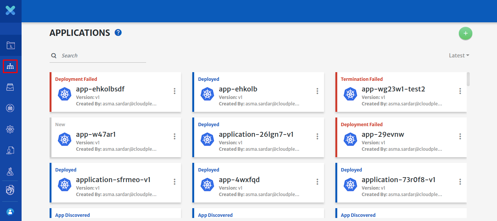

Select ***Create New User-Managed*** Kubernetes cluster.

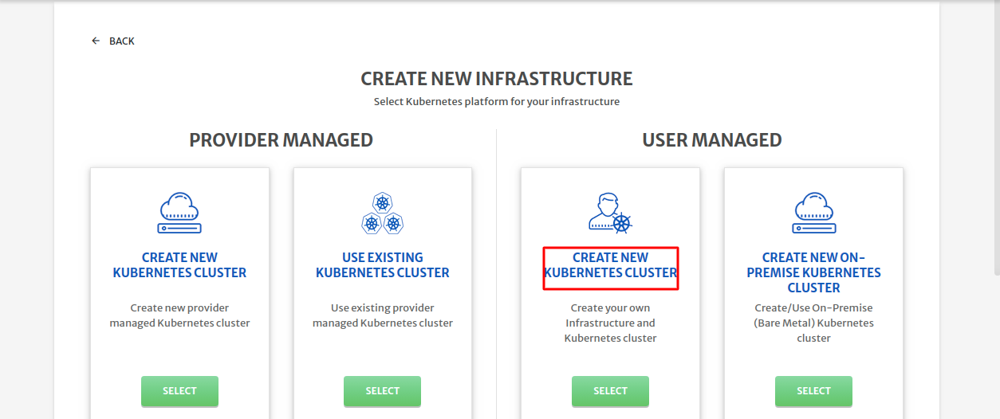

Cloudplex platform will populate the basic info (Infrastructure name, Infrastructure Id) itself.

For this lab, we will use [AWS](https://aws.amazon.com/) as our cloud provider (you must have an account on AWS in order to use it). Provide cloud provider credentials and save them as profile for future use.

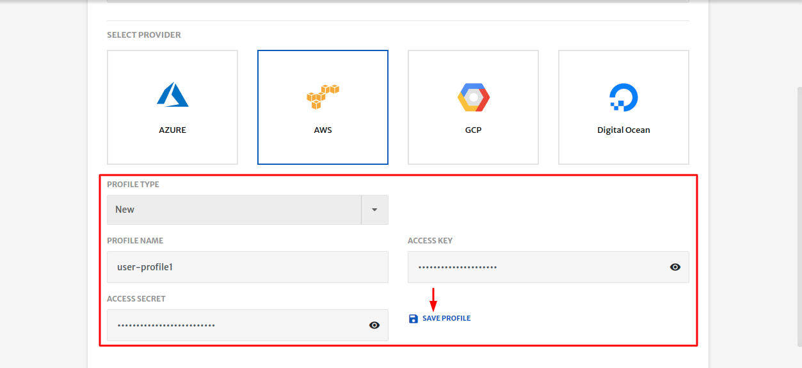

Cloudplex platform provide an easy way to save all your [Secret Credentials](https://docs.cloudplex.io/#/pages/user-guide/components/credentials-profile/credentials-profile?id=credentials-profile) in a secure vault.

Select the region & zone where you want to create your cluster.

Click on the ***Next*** button.

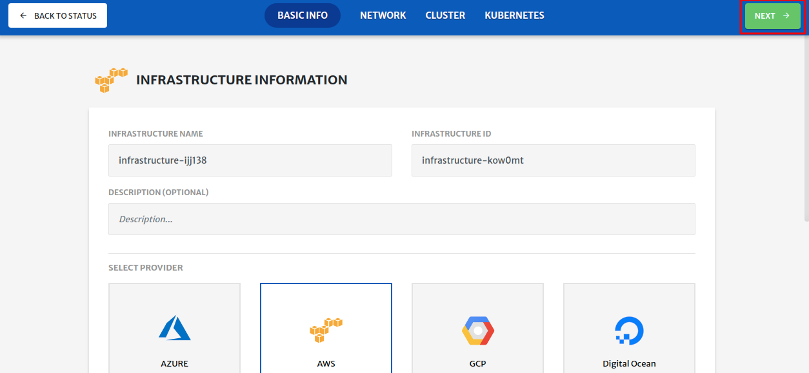

#### Configure AWS Network

CloudPlex automatically configures a complete network for you. 

One  [VPC](https://aws.amazon.com/vpc/), Two [subnets](https://docs.aws.amazon.com/vpc/latest/userguide/VPC_Subnets.html), One [Security Group](https://docs.aws.amazon.com/vpc/latest/userguide/VPC_SecurityGroups.html), One Route Table, and One Internet Gateway are added and configured by the platform.

See [AWS](https://docs.aws.amazon.com/vpc/) documentation to further learn about these terms

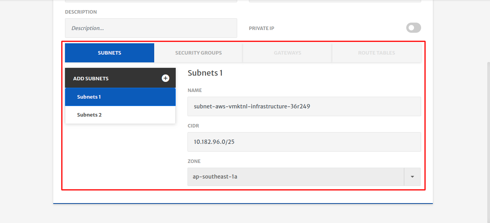

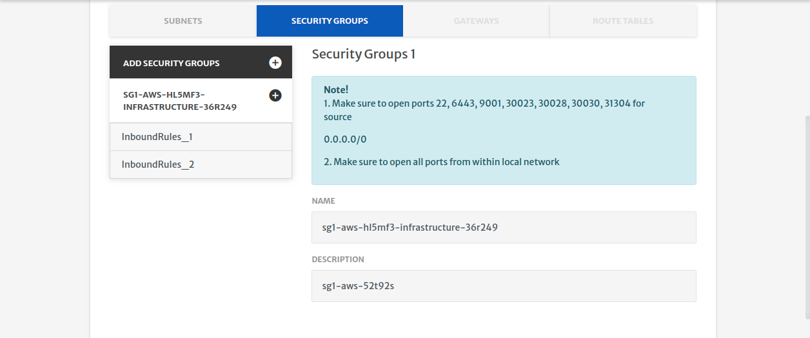

CloudPlex gives you the option to deploy a private cluster (Nodes in a private cluster are allocated private IP addresses only) 

To deploy a private cluster, enable the ***Private IP*** option. 

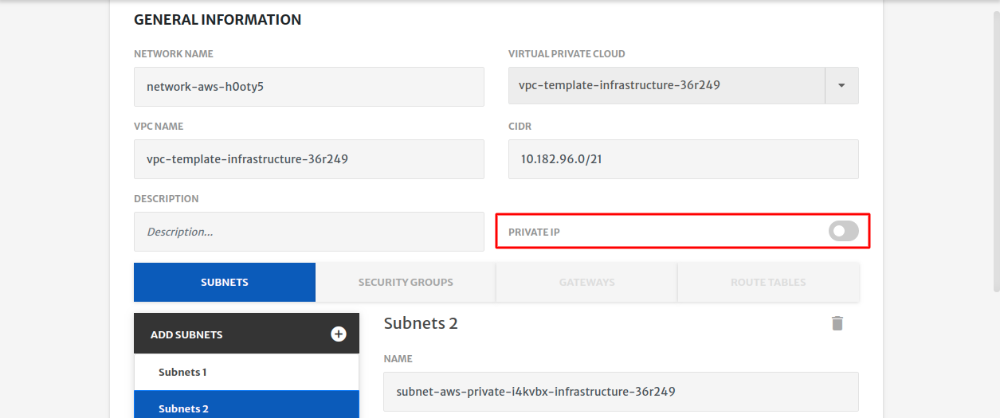

You can further customize your network based on your requirements. Click on the plus button to add new subnets and security groups and configure them accordingly

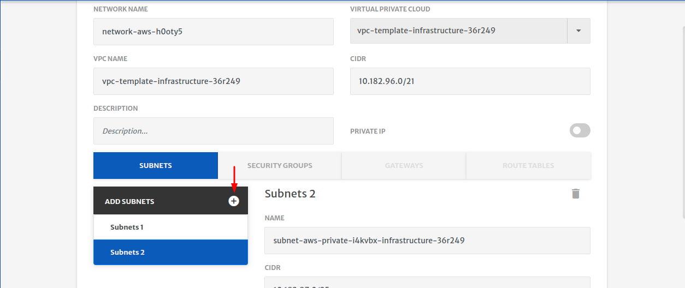

Cloudplex will automatically configure route tables and an internet gateway, but for this lab we are going to stick to the default configurations.

#### Configure AWS cluster

Clicking on the ***next*** button will take you to the cluster tab.

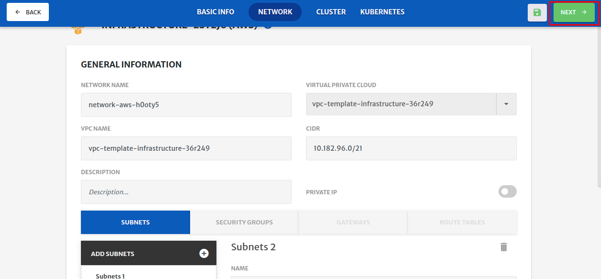

CloudPlex will automatically create One [Node Pool](https://docs.cloudplex.io/#/pages/user-guide/components/cluster/um-new-cluster/aws-cluster/aws-cluster?id=aws) with default configurations. You may overwrite this with your own configuration.

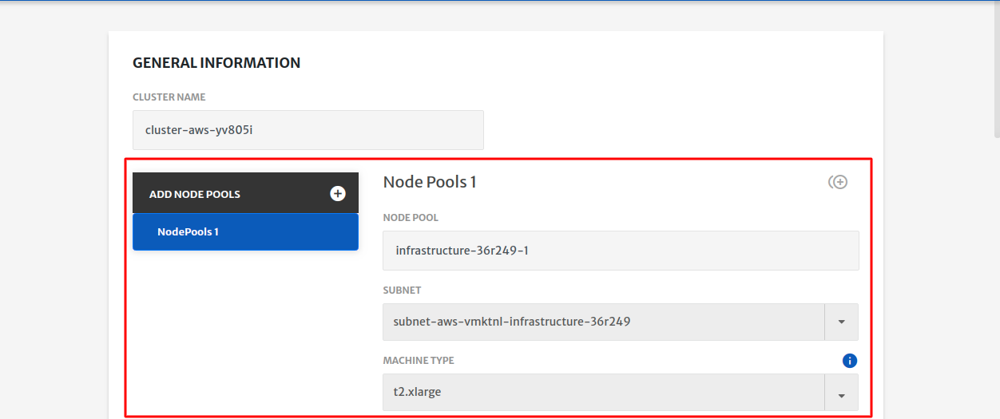

Next you will select the Key type, if you have an existing ***SSH*** key, select it. If you want to generate a new key, provide the key name. 

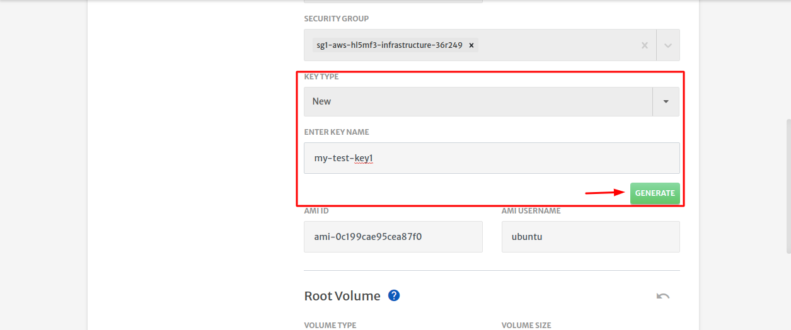

you can also download the key by checking the ***Download Key*** option and save your generated key [credentials](https://docs.cloudplex.io/#/pages/user-guide/components/credentials-profile/credentials-profile?id=credentials-profile) in our secure vault.

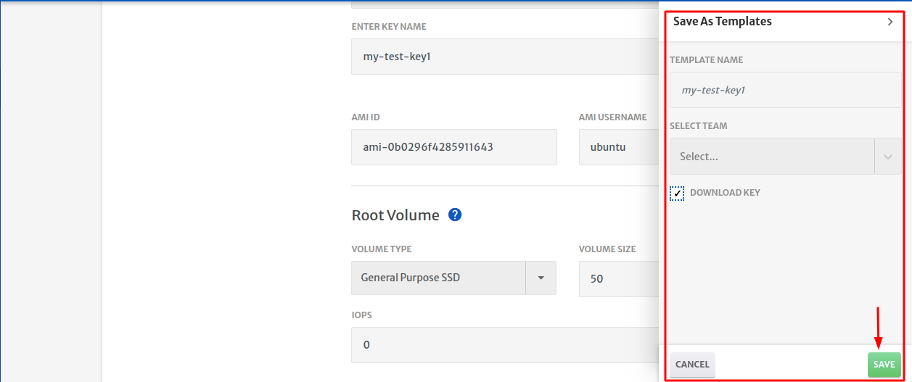

CloudPlex gives you an option to bring your own custom image or use market place Images

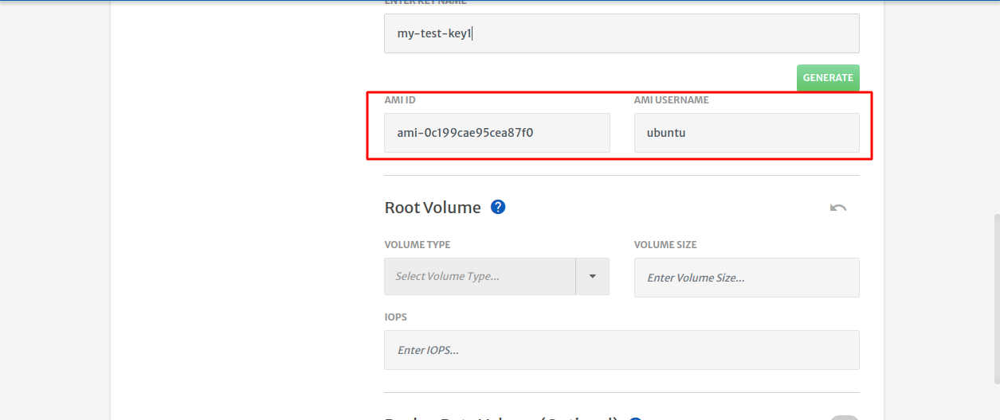

Adding another node pool is easy, and you may do so by clicking on the Clone or Create button.

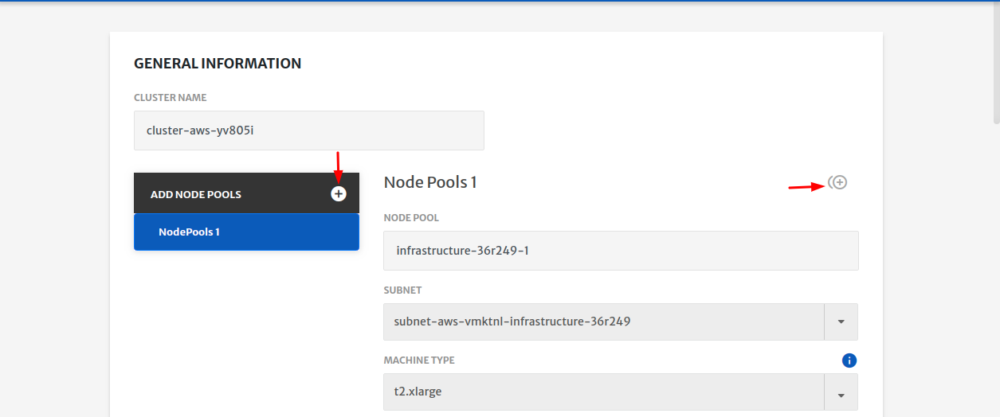

Now you have configured your cluster. Click on the ***Next*** button.

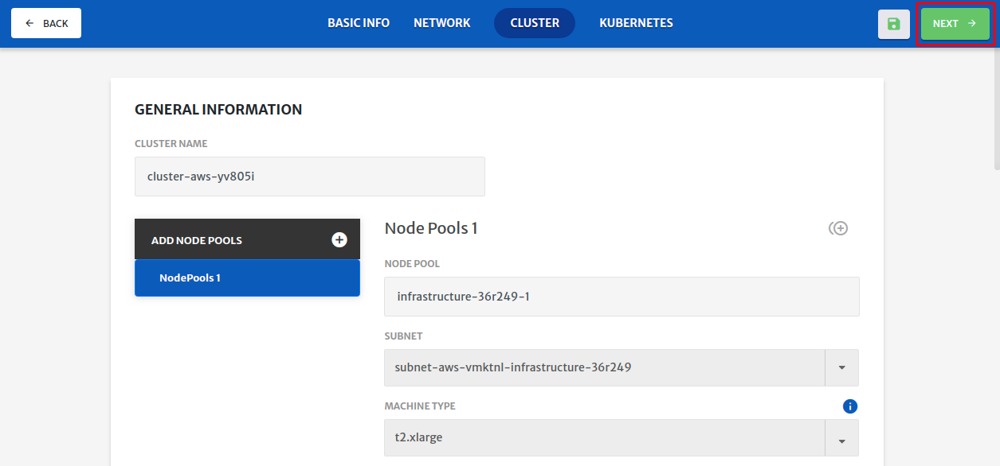

This is the Kubernetes configuration tab, where you can select your Kubernetes version and other options. For this lab, we will use the default configuration provided by the platform. 

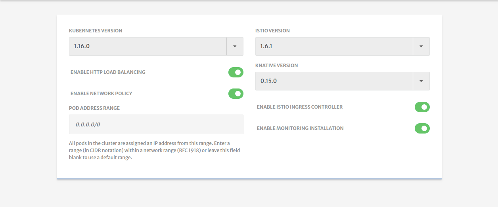

Click on the ***save*** button to save all your configurations.

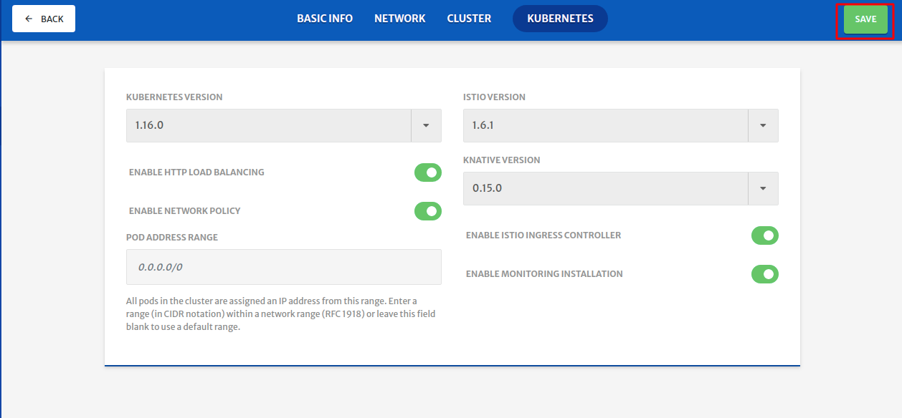

##### provision your configured Infrastructure

Click on the Start button to start deploying your own Kubernetes cluster in the AWS cloud.

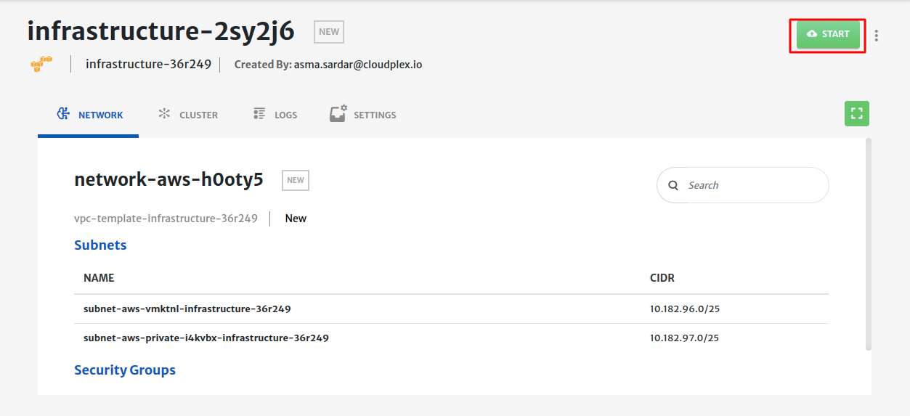

You will see the logs as the infrastructure deployment progresses.

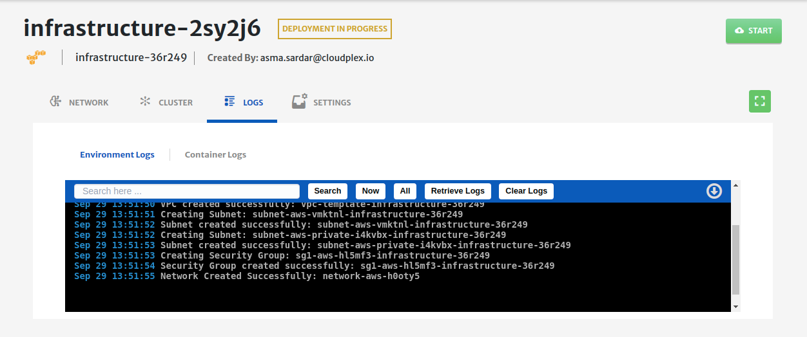

Click on the cluster tab to see the live status of your cluster.

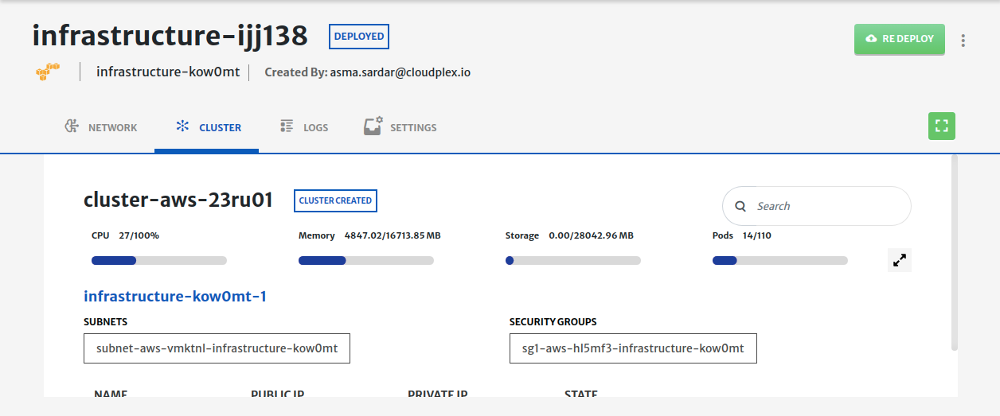

***Cluster live status*** is a complete dashboard that gives you the ***live status*** about the health and consumption of the nodes in your cluster

To avoid unnecessary costs, dont forget to terminate your infrastructure when you are done.

Click on the ***terminate*** button to delete all your resources from AWS.

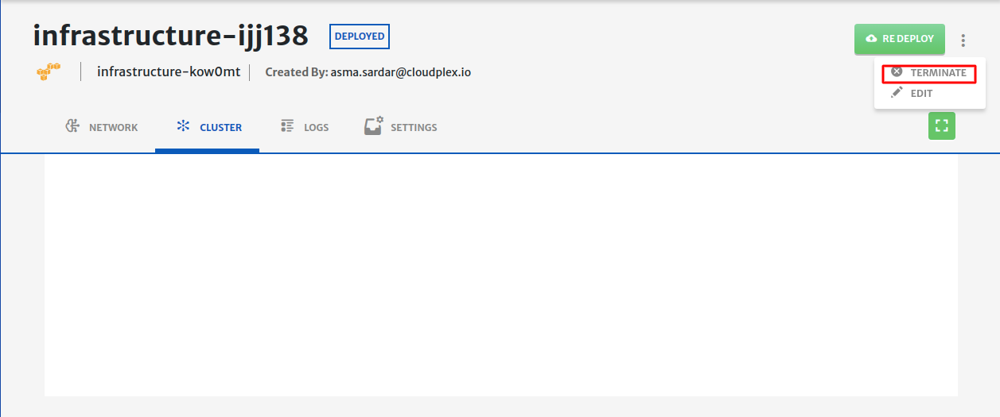

#### Conclusion

You have just deployed a user-managed Kubernetes cluster on AWS using CloudPlex, the Kubernetes application platform for developers 
