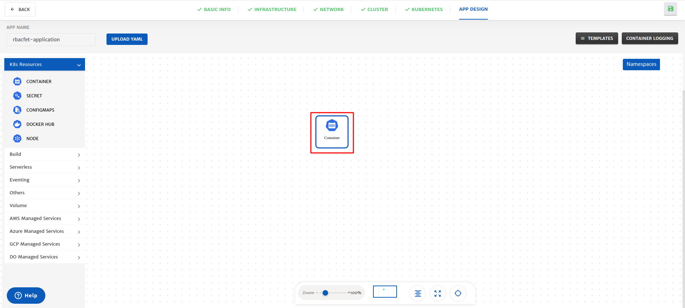
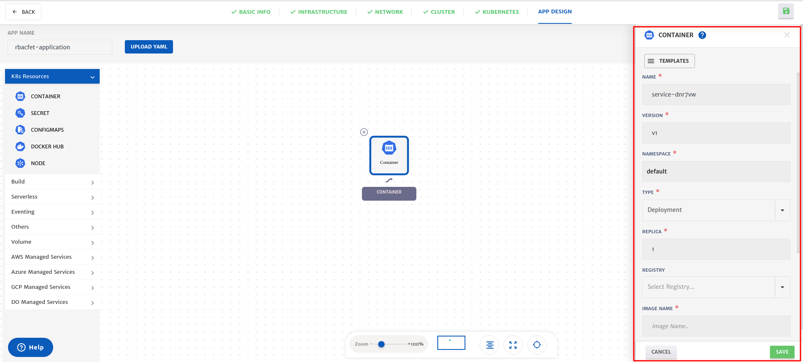
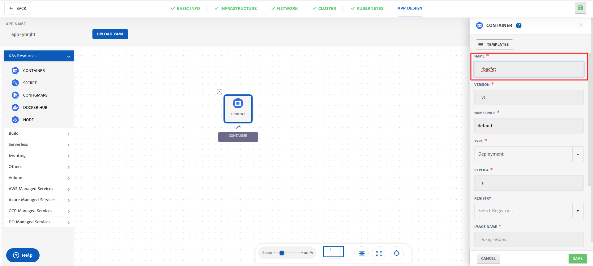
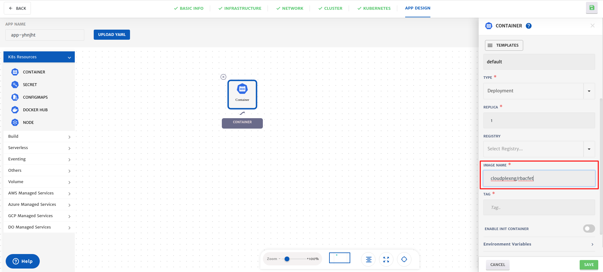
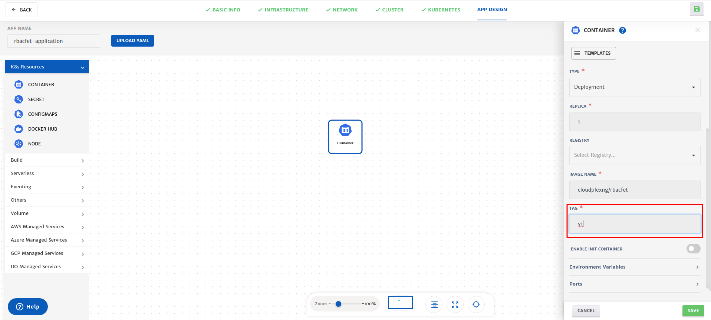
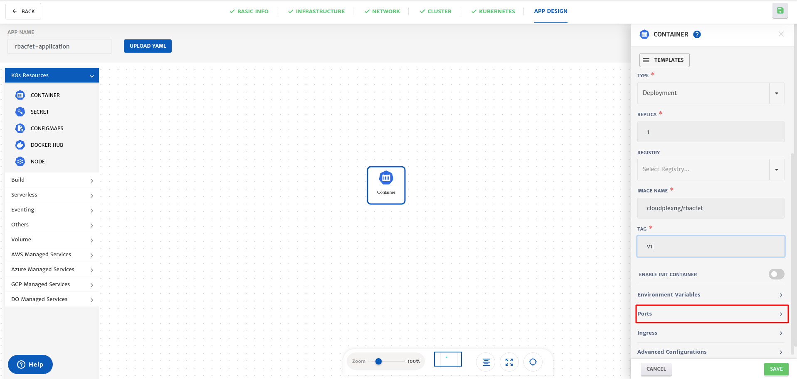
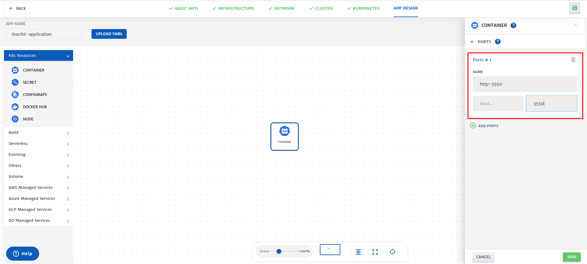
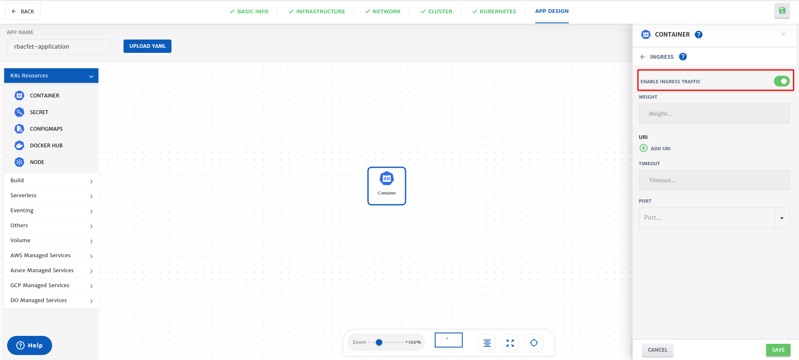
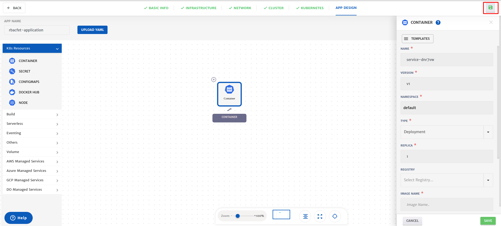
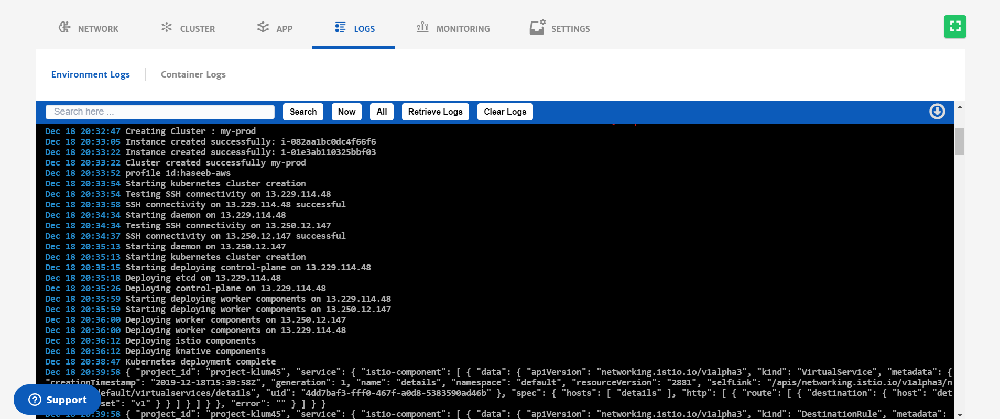

#### Before you begin

- Create [Cloudplex platform](https://app.cloudplex.io/register) account
- Read [Tutorial](cloudplex.io/tutorials/deployment) of the lab

#### Code Repository

https://github.com/cloudplex-io/k8s-rbac-sample-app

#### Add RbacFet Service

RbacFet application is a restful microservice which will return **Rbac permissions** of the Kubernetes Secret object

Locate the **Container** services from K8 resources in the pallet.


Drag-n-drop **container** service from pallet to canvas



Select the service to open configuration of the service on the right side of the window



1. Change name of the service to **rbacfet**

   


2. Enter the image name **cloudplexng/rbacfet**

   

4. Enter tag of the image **v1**

   

##### Add new Port

[Ports](https://kubernetes.io/docs/concepts/services-networking/connect-applications-service/#the-kubernetes-model-for-connecting-containers) are required to access your applications. Click on the **Port section** to add a new port



Click on Add ports button to add a new port

```yaml
name : http-3550
container Port : 3550
```



Click on the back button on top of the configurations.


#### Enable Ingress Traffic

​[Ingress gateway](https://istio.io/docs/tasks/traffic-management/ingress/ingress-control/) will allow you to access service from the internet. Click on the Ingress section to enable ingress traffic.



Click on the back button on top of the configurations.

##### Save Service

Click on the save button to save the configuration of the service

#### Save Application

Click on the **Save** button at the bottom right corner




#### Your Application Logs

In the log window, you can see the logs of your infrastructure, Kubernetes Cluster and Application which you have deployed.

**!! Deployment will take around 15 minutes!!** 




#### Accessing Your Application

Click on the App to get Ingress gateway Endpoint


Copy Ingress Endpoint and Paste in browser new Tab. 


#### Cleanup

Click on the **Terminate** button to remove all the resources from the cloud.
