#### Before you begin

- Create [Cloudplex platform](https://app.cloudplex.io/register) account
- Read [Tutorial](cloudplex.io/tutorials/deployment) of the lab

#### Code Repository

https://github.com/cloudplex-io/callerinfo-sample-app

#### Add Volume Service

A [PersistentVolume](https://kubernetes.io/docs/concepts/storage/persistent-volumes/) (PV) is a piece of storage in the cluster that has been dynamically provisioned by Kubernetes using a [StorageClass](https://kubernetes.io/docs/concepts/storage/storage-classes).

HostFet application required persistent volume to store **caller** information

Lets drop a volume service on canvas which will create **Storage Class**, **Persistent Volume Claim**, and **Persistent Volume** 

Locate the **Volume** services in the pallet.

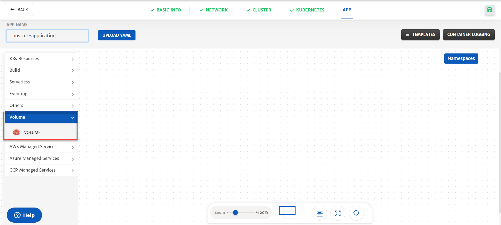

Drag-n-drop volume service from pallet to canvas

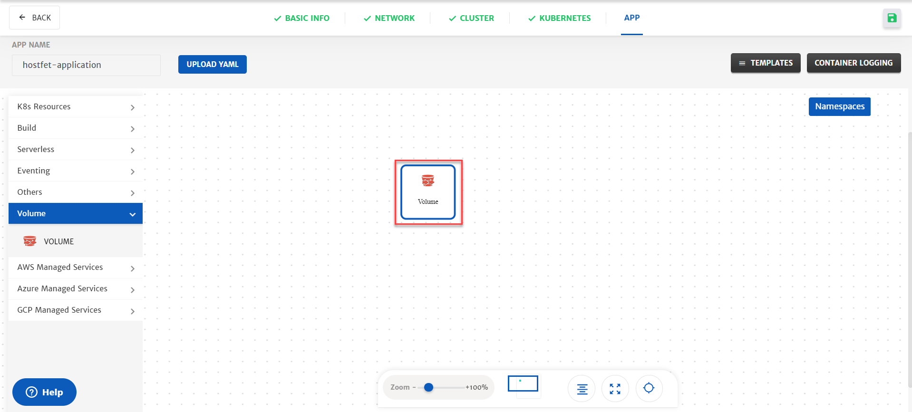

Type namespace **default** of the service

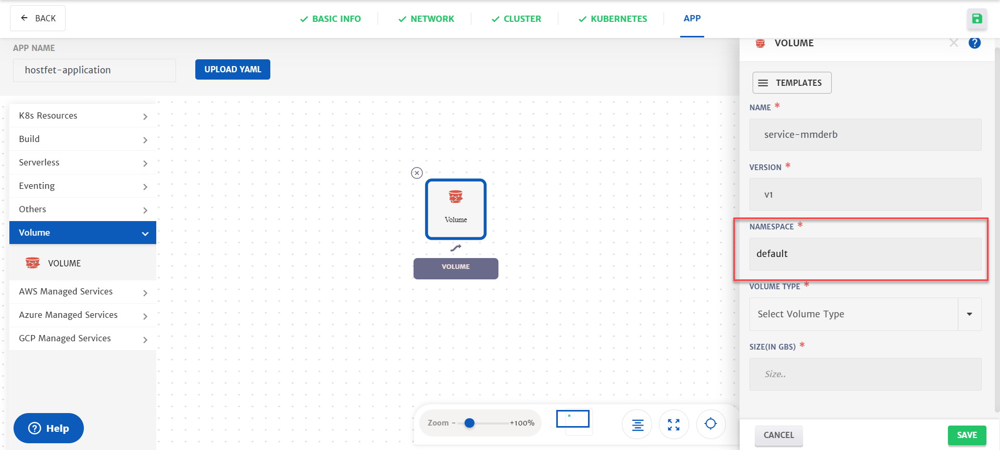

Select Volume type **gp2** of the service

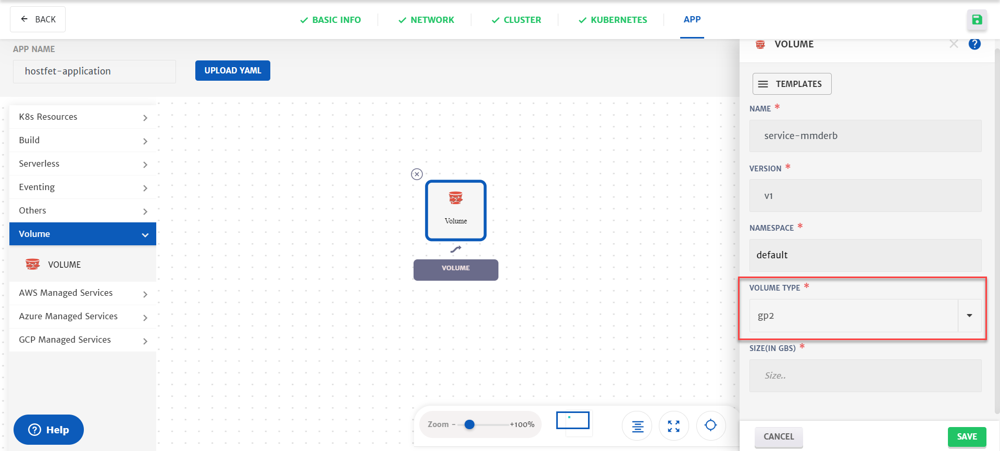

Type volume size **1** in the size text field

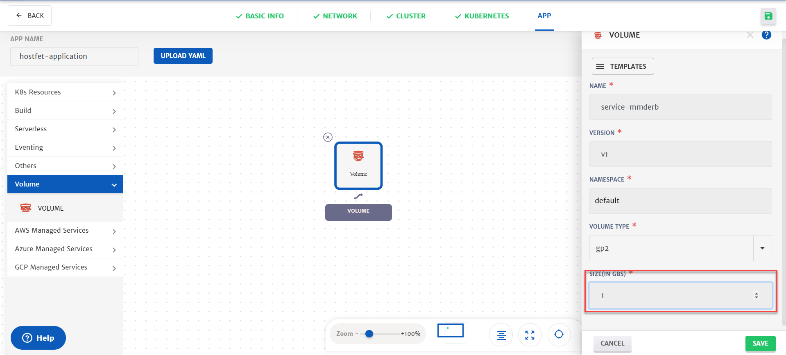

Click on the save button to save the configuration of the service

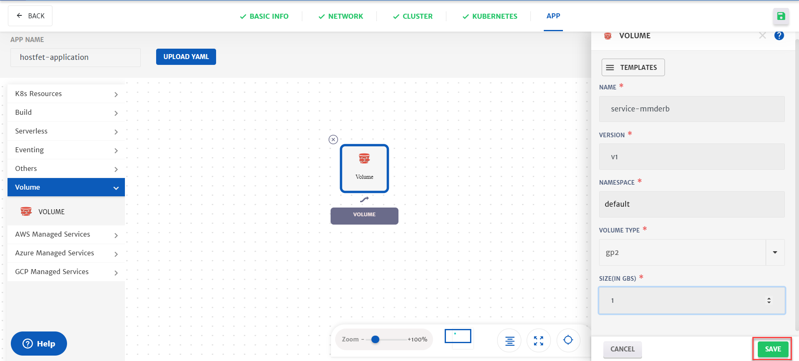

#### Add hostfet Service

HostFet application is a restful microservice which stores **caller** information on the volume and return Hostname

Locate the **Container** services from K8 resources in the pallet.

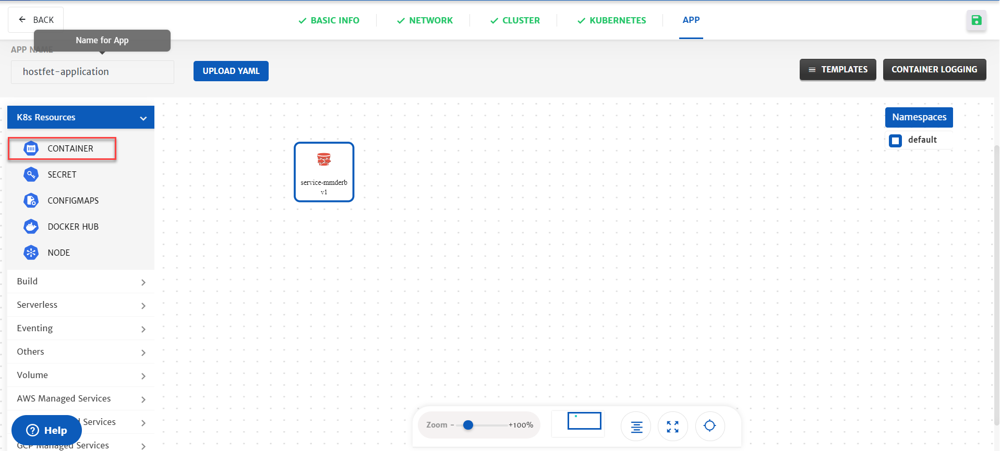

Drag-n-drop **container** service from pallet to canvas

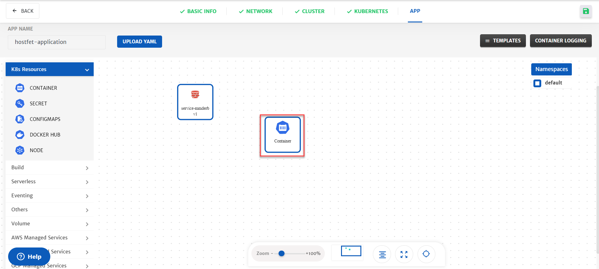

Select the service to open configuration of the service on the right side of the window

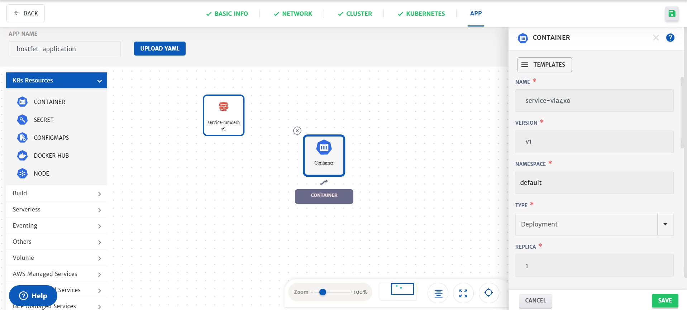

1. Change name of the service to **hostfet**

   

2. Select **Statefulset** from the type dropdown

   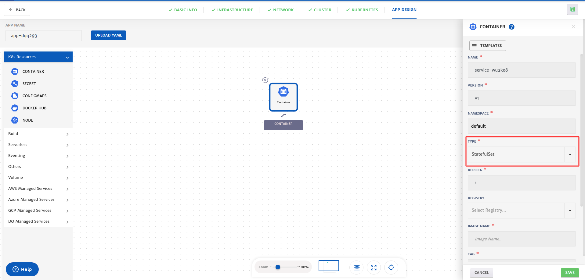

3. Enter the image name **cloudplexng/hostfet**

   

4. Enter tag of the image **v1**

   

5. Increase the number of replicas to **2**

   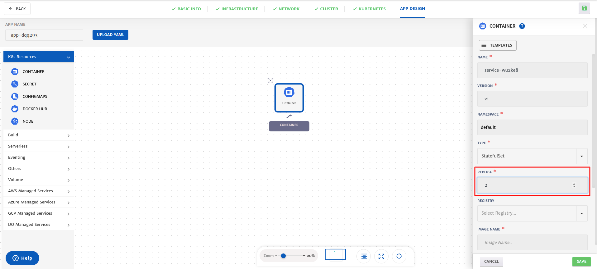


**Mount Volume**

All the volume will be available in **container service** which have dependency between them. 

Lets select the volume which we have added on the canvas and provide the mount path

Click on configure volume container section

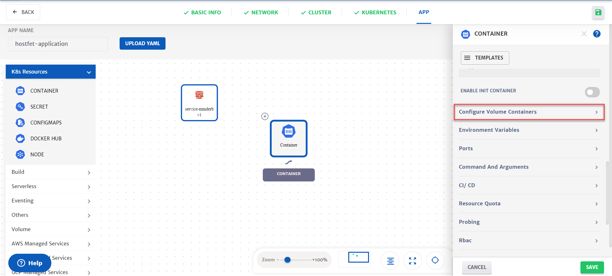

Select your volume and type mount path

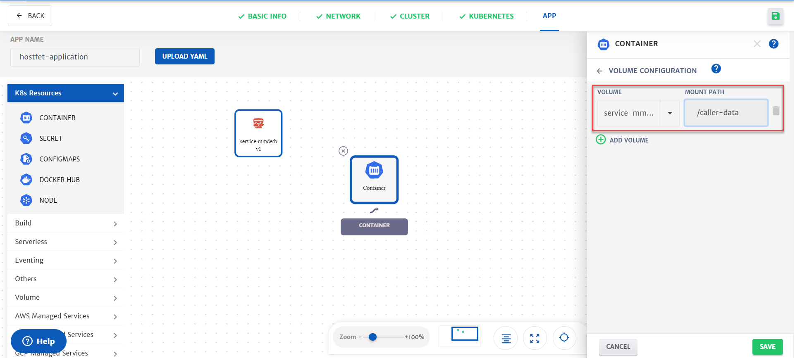

Click on the back button on top of the configurations.


##### Add new Environment Variable

Click on the **Environment variables section** to add a new [environment variable](https://kubernetes.io/docs/tasks/inject-data-application/define-environment-variable-container/#define-an-environment-variable-for-a-container).

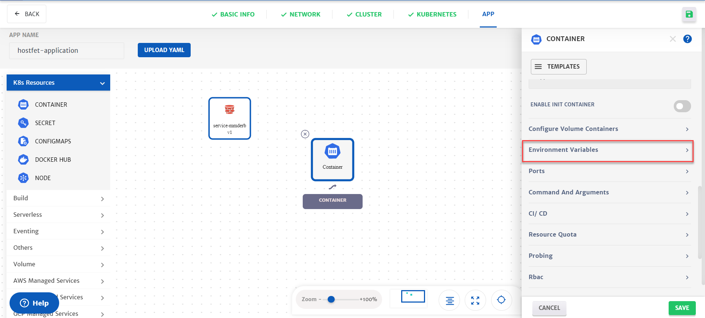


Cloudplex provides two types of variables (**Static, Dynamic**). Let's add a static environment variable.

```yaml
Key : DIR_PATH
Value : /caller-data
```
** **/caller-data** is the volume mount path


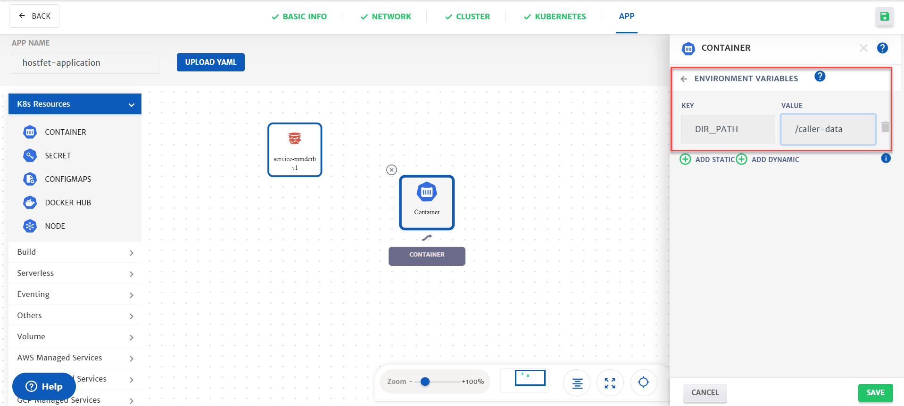

Click on the back button on top of the configurations.

##### Add new Port

[Ports](https://kubernetes.io/docs/concepts/services-networking/connect-applications-service/#the-kubernetes-model-for-connecting-containers) are required to access your applications. Click on the **Port section** to add a new port

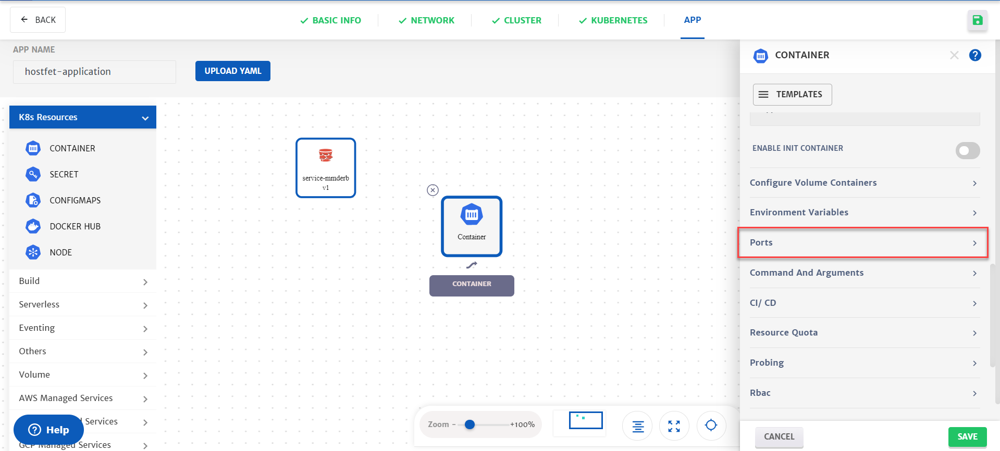

Click on Add ports button to add a new port

```yaml
name : http-3550
container Port : 3550
```

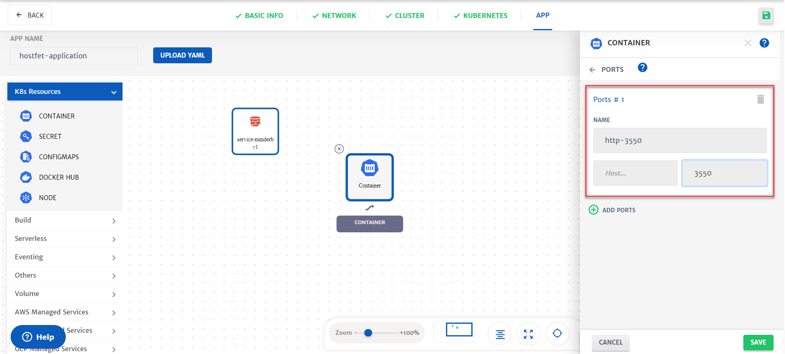

Click on the back button on top of the configurations.


#### Enable Ingress Traffic

​[Ingress gateway](https://istio.io/docs/tasks/traffic-management/ingress/ingress-control/) will allow you to access service from the internet. Click on the Ingress section to enable ingress traffic.

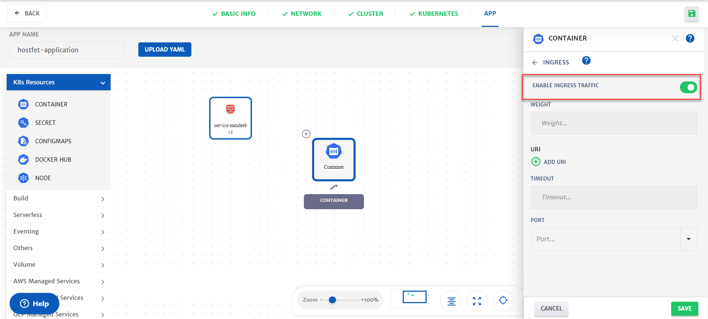

Click on the back button on top of the configurations.

##### Save Service

Click on the save button to save the configuration of the service

#### Save Application

Click on the **Save** button at the bottom right corner

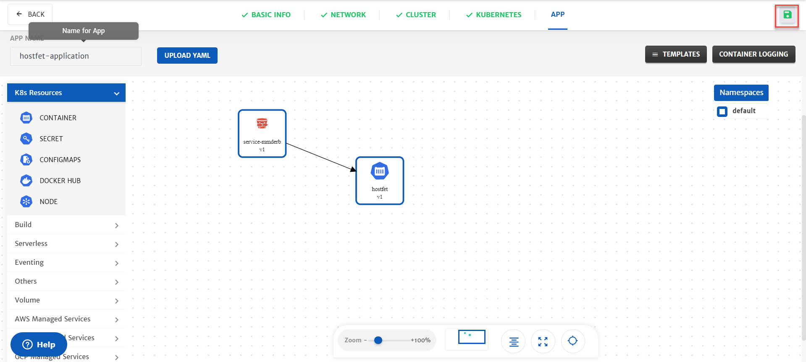


#### Your Application Logs

In the log window, you can see the logs of your infrastructure, Kubernetes Cluster and Application which you have deployed.

**!! Deployment will take around 15 minutes!!** 


#### Accessing Your Application

Click on the App to get Ingress gateway Endpoint

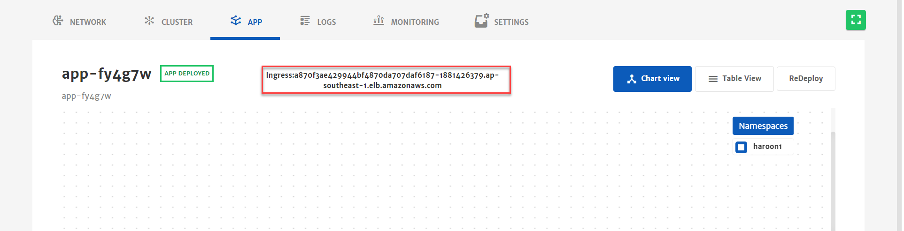


Copy Ingress Endpoint and Paste in browser new Tab. 


#### Cleanup

Click on the **Terminate** button to remove all the resources from the cloud.